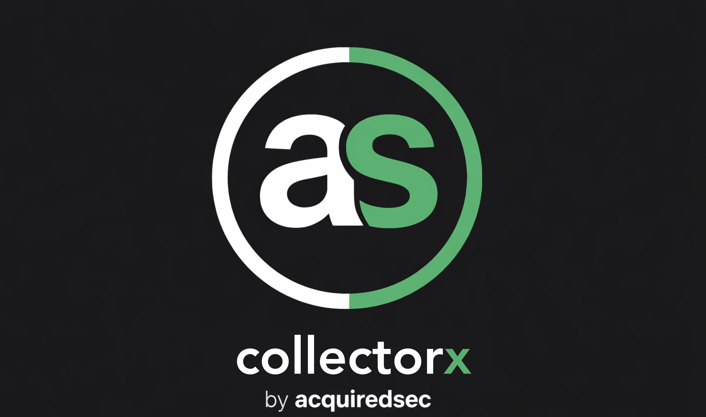

<p align="center">
  
</p>

<h1 align="center">CollectorX</h1>

<p align="center">
  <strong>Fast, forensically-sound Windows artifact collector built in Go</strong><br>
  KAPE-compatible target definitions &bull; Three-pass locked file recovery &bull; Built-in web UI
</p>

<p align="center">
  <a href="#features">Features</a> &bull;
  <a href="#quick-start">Quick Start</a> &bull;
  <a href="#cli-reference">CLI Reference</a> &bull;
  <a href="#web-ui">Web UI</a> &bull;
  <a href="#collection-targets">Targets</a> &bull;
  <a href="#output-format">Output Format</a> &bull;
  <a href="#architecture">Architecture</a>
</p>

---

## Features

- **KAPE-compatible targets** — Uses the same `.tkape` YAML format. Drop in community targets from [KapeFiles](https://github.com/EricZimmerman/KapeFiles) or write your own.
- **Three-pass locked file recovery** — Normal copy → Raw NTFS via `go-ntfs` → VSS shadow copy fallback. Locked registry hives, `$MFT`, and `$UsnJrnl` are collected reliably on live systems.
- **Single static binary** — Zero dependencies. Deploy via USB, network share, or EDR. Cross-compiled for Windows (primary), with Linux/macOS support for offline image processing.
- **Forensic integrity** — MD5 + SHA256 hashing on every collected file. Full JSON manifest with chain-of-custody metadata (operator, case number, timestamps).
- **Built-in web UI** — Browser-based collection interface with real-time progress and target selection.
- **Smart deduplication** — Files referenced by multiple overlapping targets are collected only once.
- **Streaming ZIP output** — Evidence packaged into a single `evidence_<hostname>_<timestamp>.zip` with preserved directory structure.

## Quick Start

### CLI Collection

```bash
# Collect ForensicTriage (default) from the C: drive
forensic-collect.exe -s C:\ -o D:\output

# Collect with case metadata
forensic-collect.exe -s C:\ -o D:\output --case-number IR-2026-042 --operator jdoe

# Collect specific targets
forensic-collect.exe -s C:\ -o D:\output -c KapeTriage,NTDS

# Dry run — see what would be collected without copying
forensic-collect.exe -s C:\ -o D:\output --dry-run

# Collect from a mounted forensic image
forensic-collect.exe -s /mnt/image -o /cases/output
```

### Web UI

```bash
# Start the web server on port 8080
forensic-collect.exe --serve

# Custom port
forensic-collect.exe --serve --port 9090
```

Navigate to `http://localhost:8080` in your browser.

## CLI Reference

```
forensic-collect v0.5.0 (Go)

Usage: forensic-collect [flags]

Collection Flags:
  -s, --source <path>        Source drive or mounted image root directory (required)
  -o, --output <path>        Output directory for ZIP archive and manifest (required)
  -c, --collect <targets>    Comma-separated target names (default: ForensicTriage)
  -t, --targets-dir <path>   Path to .tkape target definitions (default: ./targets)
      --max-size-mb <n>      Maximum file size to collect in MB (0 = unlimited)
      --case-number <str>    Case number recorded in manifest
      --operator <str>       Operator name recorded in manifest
      --no-vss               Disable VSS shadow copy fallback for locked files
      --list-targets         List all available targets and exit
      --dry-run              Show what would be collected without copying
  -v                         Verbose output

Web UI Flags:
      --serve                Start web UI server instead of CLI mode
      --port <n>             Web UI port (default: 8080)
```

## Web UI

The built-in web UI provides a browser-based interface for artifact collection:

- **Target selection** — Browse and select from all available `.tkape` targets
- **Real-time progress** — Live progress tracking during collection with per-file status
- **No installation** — Single binary serves the entire UI; works from a USB drive

Start with `--serve` and open `http://localhost:8080`.

## Collection Targets

CollectorX ships with **272 target definitions** organized by category:

| Category | Examples |
|----------|----------|
| **Compound** | `ForensicTriage`, `KapeTriage`, `SANS_Triage`, `ServerTriage` |
| **Windows** | `EventLogs`, `FileSystem`, `RegistryHives`, `Prefetch`, `SRUM`, `ScheduledTasks` |
| **Antivirus** | `WindowsDefender`, `Symantec`, `McAfee`, `MalwareBytes` |
| **Browsers** | `Chrome`, `Firefox`, `Edge`, `InternetExplorer`, `Opera`, `Brave` |
| **Apps** | `CloudStorage`, `MessagingClients`, `RemoteAccess`, `FTPClients` |
| **Logs** | `CombinedLogs`, `EventTraceLogs`, `PowerShellConsole` |

### Default: ForensicTriage

The default `ForensicTriage` target is a comprehensive superset of KapeTriage, collecting:

- Event logs (`.evtx` + `.evt`) and ETL traces
- File system metadata (`$MFT`, `$UsnJrnl:$J`, `$LogFile`, `$SDS`)
- Registry hives (System + User + RegBack)
- Execution evidence (Prefetch, Amcache, SRUM)
- User activity (LNK files, Jump Lists, Shellbags, Windows Timeline, Browser History)
- Persistence (Scheduled Tasks, WMI/WBEM, WMI MOF)
- Security (Windows Defender logs, DPAPI keys, Recycle Bin)
- Active Directory (`NTDS.dit` + transaction logs)
- AI query history (Claude Code, ChatGPT Desktop)

**Always-injected targets** — Regardless of which compound target is selected, these are always collected:
- `NTDS.dit` (Active Directory)
- ETL traces (`Windows\System32\LogFiles\WMI\`)
- Windows Defender logs
- AI query history

### Custom Targets

List available targets:

```bash
forensic-collect.exe --list-targets
```

Write custom `.tkape` files using the standard KAPE target format:

```yaml
Description: Custom artifact collection
Author: Your Name
Version: 1.0
RecreateDirectories: true
Targets:
    -
        Name: My Custom Artifact
        Category: Custom
        Path: C:\path\to\artifact\
        FileMask: "*.dat"
        Recursive: true
```

## Output Format

### ZIP Archive

```
evidence_WORKSTATION01_20260310_143022.zip
├── manifest.json
├── EventLogs/
│   └── Windows/System32/winevt/logs/
│       ├── Security.evtx
│       ├── System.evtx
│       └── ...
├── Registry/
│   ├── Windows/System32/config/
│   │   ├── SAM
│   │   ├── SYSTEM
│   │   ├── SOFTWARE
│   │   └── SECURITY
│   └── Users/jdoe/
│       ├── NTUSER.DAT
│       └── AppData/Local/Microsoft/Windows/UsrClass.dat
├── FileSystem/
│   ├── $MFT
│   └── $Extend/$UsnJrnl:$J
├── Execution/
│   └── Windows/prefetch/*.pf
└── ...
```

The original Windows directory structure is preserved under each category folder, making the output directly compatible with downstream forensic processing tools.

### Manifest (manifest.json)

Every collection includes a JSON manifest with full chain-of-custody metadata:

```json
{
  "collection_id": "a1b2c3d4-...",
  "hostname": "WORKSTATION01",
  "collection_start": "2026-03-10T14:30:22Z",
  "collection_end": "2026-03-10T14:32:15Z",
  "tool_version": "0.5.0",
  "operator": "jdoe",
  "case_number": "IR-2026-042",
  "targets_used": ["ForensicTriage.tkape"],
  "files": [
    {
      "source_path": "C:\\Windows\\System32\\winevt\\logs\\Security.evtx",
      "dest_path": "EventLogs/Windows/System32/winevt/logs/Security.evtx",
      "size_bytes": 69632,
      "md5": "d41d8cd98f00b204e9800998ecf8427e",
      "sha256": "e3b0c44298fc1c149afbf4c8996fb92427ae41e4649b934ca495991b7852b855",
      "collected_via": "NormalCopy",
      "target_name": "Event logs Win7+"
    }
  ],
  "stats": {
    "total_files": 342,
    "total_bytes": 1073741824,
    "pass1_files": 310,
    "pass2_files": 28,
    "pass3_files": 4,
    "failed_files": 0
  }
}
```

## Architecture

### Three-Pass Collection Engine

```
Pass 1: Normal Copy (os.Open → io.Copy)
  ↓ failed files
Pass 2: Raw NTFS (go-ntfs direct volume read)
  ↓ failed files
Pass 3: VSS Shadow Copy (last resort, disable with --no-vss)
```

Files marked `AlwaysAddToQueue: true` in target definitions (e.g., `$MFT`, `$UsnJrnl`) skip Pass 1 and go directly to raw NTFS for reliability.

### Target Resolution

```
Compound Target (ForensicTriage.tkape)
  ├── EventLogs.tkape → C:\Windows\System32\winevt\logs\*.evtx
  ├── FileSystem.tkape
  │   ├── $MFT.tkape → C:\$MFT
  │   └── $J.tkape → C:\$Extend\$UsnJrnl:$J
  ├── RegistryHives.tkape
  │   ├── RegistryHivesSystem.tkape → SAM, SYSTEM, SOFTWARE, SECURITY
  │   └── RegistryHivesUser.tkape → NTUSER.DAT, UsrClass.dat (per user)
  └── ... (272 total target definitions)
```

Variable expansion (`%user%`, `%SystemRoot%`, etc.) and cycle detection are handled automatically during resolution.

### Project Structure

```
forensic-collect-go/
├── main.go                    # CLI + web server entry point
├── internal/
│   ├── collector/             # Three-pass collection engine
│   │   ├── engine.go          # Pass 1/2/3 orchestration
│   │   └── resolve.go         # Target → concrete file resolution
│   ├── output/                # ZIP writer + manifest + hashing
│   │   └── writer.go          # Streaming ZIP with MD5/SHA256
│   ├── pathresolver/          # KAPE variable expansion (%user%, etc.)
│   ├── rawntfs/               # Raw NTFS volume reader (go-ntfs)
│   ├── server/                # Web UI HTTP handlers
│   ├── target/                # .tkape YAML parser + resolver
│   ├── vss/                   # VSS shadow copy creation
│   └── web/                   # Embedded web UI (HTML/JS/CSS)
└── targets/                   # 272 .tkape target definitions
    ├── Compound/              # ForensicTriage, KapeTriage, etc.
    ├── Windows/               # OS-level artifacts
    ├── Antivirus/             # AV product logs
    ├── Browsers/              # Browser artifacts
    ├── Apps/                  # Application artifacts
    └── Logs/                  # Log file targets
```

## Building

```bash
# Build for current platform
go build -o forensic-collect .

# Cross-compile for Windows (most common deployment)
GOOS=windows GOARCH=amd64 go build -o forensic-collect.exe .
```

## Comparison with Other Collectors

| Feature | CollectorX | KAPE | Velociraptor |
|---------|:----------:|:----:|:------------:|
| KAPE target compatibility | Yes | Yes | Yes (via KapeFiles) |
| Locked file recovery (Raw NTFS) | Yes | Yes | Yes |
| VSS fallback | Yes | Yes | No (uses raw NTFS) |
| Single binary deployment | Yes | Yes | Yes |
| Web UI | Yes | No | Yes (full server) |
| AI query history collection | Yes | No | No |
| NTDS.dit auto-collection | Yes (always) | Manual target | Manual target |
| ETL trace auto-collection | Yes (always) | Manual target | Manual target |
| Per-file MD5+SHA256 hashing | Yes | SHA1 | SHA256 |
| JSON manifest | Yes | CSV log | JSON |
| Open source | Yes | No | Yes |

## License

MIT — See [LICENSE](LICENSE) for details.

---

<p align="center"><sub>Built by <a href="https://acquiredsec.com">AcquiredSecurity</a></sub></p>
